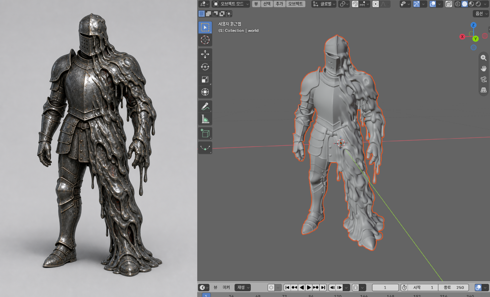

# 로컬 이미지 → 편집 가능한 3D 에셋 환경



### 📺 시연 영상
> 🔗 **영상 링크**: https://youtu.be/qapRggMK534

이 PC의 RTX 5090(32GB)에 맞춰 **Pixal3D 1024 저메모리 모드**를 기본 생성기로 사용합니다. 입력 사진 한 장에서 PBR 텍스처가 포함된 GLB를 만들고, Blender를 통해 편집 가능한 `.blend`와 Unity/Unreal 등에서 쓸 `.fbx`도 함께 생성합니다.

## 바로 사용하기

### GUI로 사용하기

최초 한 번 GUI 의존성을 설치합니다.

```powershell
python -m pip install -r .\requirements-gui.txt
```

그다음 로컬 GUI를 실행합니다.

```powershell
python .\app.py
```

브라우저에서 `http://127.0.0.1:7860`이 자동으로 열립니다. 이미지 선택 및 미리보기, 생성 모델 선택, 선택적 프롬프트 입력, 실시간 로그 확인, GLB/BLEND/FBX 결과 다운로드를 한 화면에서 진행할 수 있습니다. 작업별 결과는 `artifacts\gui-날짜-작업ID\`에 저장됩니다.

현재 설치된 `Pixal3D 1024`는 이미지 입력만 지원하므로 GUI에 입력한 텍스트 프롬프트가 3D 생성에 직접 반영되지는 않습니다. 해당 프롬프트는 작업 폴더의 `request.json`에 기록되며, 프롬프트를 비워두면 이미지 기반 생성만 실행됩니다. 텍스트 조건을 직접 지원하는 모델을 추가할 때는 `model_registry.py`에 모델 정의를 등록하고 `generation_pipeline.py`에 해당 핸들러를 연결하면 됩니다.

### 독립 Windows 데스크톱 앱

브라우저 없이 네이티브 창으로 실행하려면 다음 의존성을 설치한 뒤 앱을 실행합니다.

```powershell
python -m pip install -r .\requirements-desktop.txt
python .\desktop_app.py
```

데스크톱 앱 상단에는 PowerShell, NVIDIA GPU, WSL Ubuntu, Pixal3D 네이티브 확장, Blender 변환 브리지, 생성 스크립트의 연결 상태가 표시됩니다. 앱 시작 시 자동 점검하며 `연결 상태 새로고침` 버튼으로 다시 확인할 수 있습니다.

단독 실행 가능한 Windows EXE를 빌드하려면 다음을 실행합니다.

```powershell
.\scripts\build_desktop.ps1
```

결과는 `dist\Local3DModelingStudio.exe`에 생성됩니다. EXE는 GUI와 브리지 스크립트를 포함하지만, CUDA·WSL·Pixal3D·Blender는 용량과 하드웨어 의존성 때문에 기존 로컬 설치를 사용합니다. 패키징된 앱의 생성 결과는 `%USERPROFILE%\Documents\Local3DModelingStudio\artifacts`에 저장됩니다.

### PowerShell에서 사용하기

PowerShell에서 다음을 실행합니다.

```powershell
cd ..\local_modeling_mcp
.\scripts\generate_model.ps1 -Image .\inputs\chair.png -Name chair
```

출력은 `artifacts\chair\`에 생깁니다.

- `chair.glb`: PBR 재질 보존이 가장 좋은 원본. Unity에서는 glTFast 같은 GLTF 임포터 사용 권장
- `chair.blend`: Blender에서 메시, UV, 재질을 직접 수정하는 작업 파일
- `chair.fbx`: Unity/Unreal의 기본 임포터용 교환 파일

기존 GLB만 변환하려면 다음을 실행합니다.

```powershell
.\scripts\convert_model.ps1 -InputGlb C:\path\asset.glb
```

영상은 우선 일정 간격의 키 프레임으로 나눈 뒤 가장 형태가 잘 보이는 프레임을 생성 입력으로 사용합니다.

```powershell
.\scripts\extract_video_frames.ps1 -Video C:\path\turntable.mp4 -EverySeconds 2
```

환경 점검:

```powershell
.\scripts\check_environment.ps1
```

## 설치 위치와 고정 구성
*park 은 사용자 이름으로 변경해야함

- WSL: Ubuntu 24.04, 사용자 `park`
- Conda: `/home/park/miniforge3/envs/pixal3d`
- CUDA compatibility path: `/home/park/cuda-13`
- Pixal3D: `/home/park/local-modeling/Pixal3D`
- TRELLIS.2 및 CUDA 확장 소스: `/home/park/local-modeling/TRELLIS.2`
- Blender 포터블: `C:\Users\park\Applications\blender-5.2.0-windows-x64`
- Attention: FlashAttention 대신 RTX 5090에서 호환성이 높은 PyTorch SDPA
- 생성 해상도: 1024, low-VRAM 모드


## 입력 사진 팁

- 물체 하나를 화면 중앙에 크게 두고 배경과 경계를 분명하게 합니다.
- 가려진 뒷면은 모델이 추정하므로 정면·측면 정보가 함께 드러나는 3/4 시점이 유리합니다.
- 여러 시점이나 영상은 우선 선명한 키 프레임을 추출한 뒤 각 결과를 비교하는 워크플로가 안정적입니다.
- 텍스트만으로 만들 때는 클라우드 모델로 콘셉트 이미지를 만든 뒤 그 이미지를 입력하는 2단계 방식을 사용합니다.

## 엔진 이식 주의사항

GLB는 PBR 텍스처를 가장 잘 보존합니다. FBX는 엔진과 재질 체계에 따라 metallic/roughness 연결을 다시 잡아야 할 수 있습니다. 게임 투입 전에는 Blender에서 폴리곤 감축, UV 확인, 실제 크기 적용, 피벗 설정, 충돌 메시와 LOD 생성을 권장합니다.

## 사람형 자동 리깅 실험

로컬 UniRig 환경이 설치된 PC에서는 사람형 GLB의 골격·스킨 웨이트를 생성하고 Unity Humanoid용 이름으로 후처리할 수 있습니다.

```powershell
.\scripts\rig_humanoid.ps1 `
  -InputGlb .\artifacts\melting_knight\melting_knight.glb `
  -Name melting_knight
```

`melting_knight` 1차 테스트는 Unity 6.5에서 유효한 Humanoid Avatar와 실제 근육 포즈 변형까지 통과했습니다. 생성 메시의 갑옷·장식 웨이트 품질은 추가 보정이 필요합니다. 자세한 결과와 환경 구성은 [`docs/humanoid-autorig-test.md`](./docs/humanoid-autorig-test.md)를 참고하세요.

Pixal3D 코드와 각 체크포인트·의존성은 서로 다른 라이선스를 가질 수 있습니다. 특히 상업 배포 전에는 사용한 체크포인트의 Hugging Face 라이선스와 데이터/에셋 권리를 별도로 확인해야 합니다.

정확한 버전과 커밋은 `docs\environment-lock.md`에 기록되어 있습니다.
